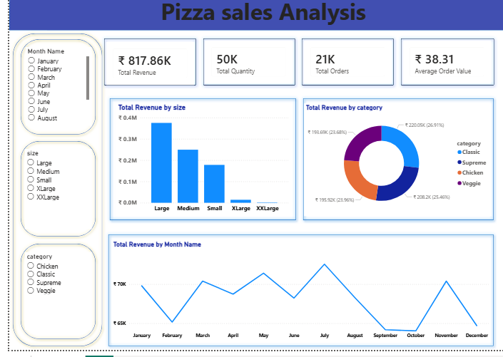
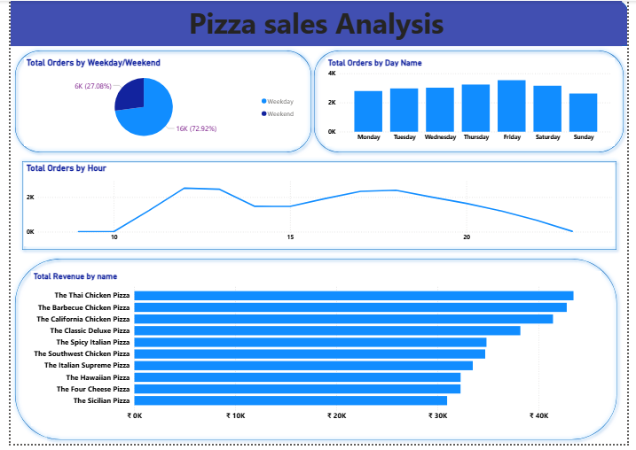

#  Pizza Sales Analysis - Power BI Dashboard

An interactive Power BI dashboard analyzing pizza sales data to uncover revenue trends, order patterns, and customer behavior across 21,000+ orders.




##  Business Problem

A pizza restaurant wants to understand its sales performance to make better business decisions. This dashboard answers key questions such as:
- Which pizzas generate the highest revenue and orders?
- What are the peak ordering hours during the day?
- Is there a significant difference between weekday and weekend sales?
- Which pizza size and category perform best?
- How does revenue trend across different months?

##  Dataset

The dataset consists of 4 CSV files with a total of 21,350+ order records:
- **orders.csv** – Order ID, date, and time of each order
- **order_details.csv** – Order ID, pizza ID, and quantity ordered
- **pizzas.csv** – Pizza ID, size, and price
- **pizza_types.csv** – Pizza name, category, and description

##  Tools Used

- **Power BI Desktop** – Dashboard design and visualization
- **Power Query** – Data cleaning and transformation
- **DAX (Data Analysis Expressions)** – Calculated columns and measures

## Process

1. Imported and cleaned data using Power Query (handled nulls, duplicates, and data type mismatches)
2. Created calculated columns:
   - `Day Name` and `Day Number` (for correct weekday sorting)
   - `Weekday/Weekend` flag
   - `Month Name` and `Hour` (extracted from date/time)
3. Built DAX measures for Total Orders, Total Revenue, Total Quantity, and Average Order Value
4. Designed a 2-page interactive dashboard with slicers for Month, Size, and Category

##  Key Insights

- **72.92%** of total orders happen on weekdays, while only **27.08%** occur on weekends — suggesting strong lunch/dinner demand during the work week
- **The Thai Chicken Pizza** generates the highest revenue among all pizza varieties
- **Large size** pizzas contribute the most to overall revenue
- **Classic category** pizzas lead in revenue share among all categories
- Order volume peaks during specific hours of the day, useful for staffing decisions

##  Sample DAX Formulas

```dax
Weekday/Weekend = IF('orders'[Day Number] IN {6,7}, "Weekend", "Weekday")

Day Number = WEEKDAY('orders'[date], 2)

Day Name = FORMAT('orders'[date], "dddd")
```

##  Repository Structure
